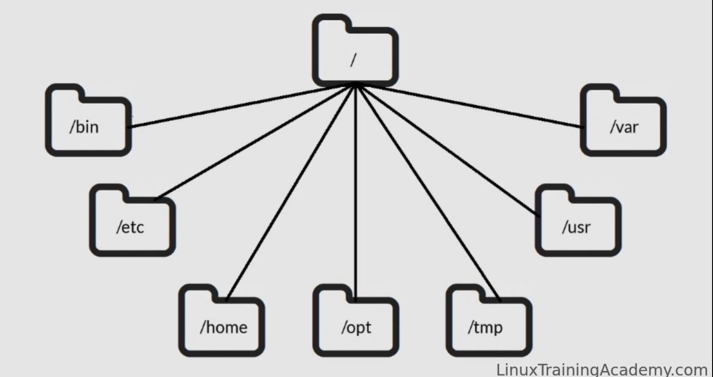
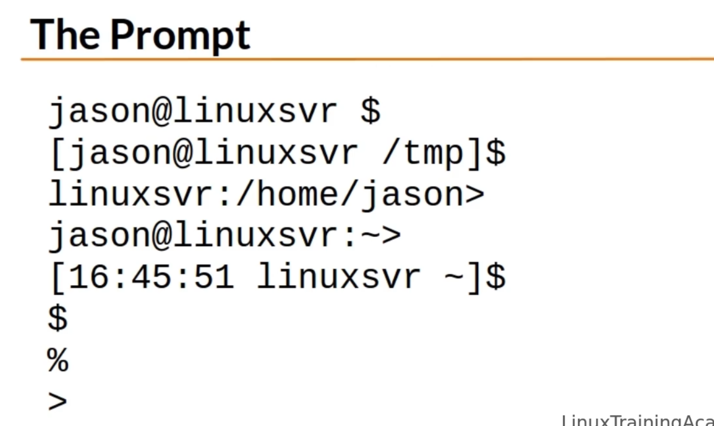
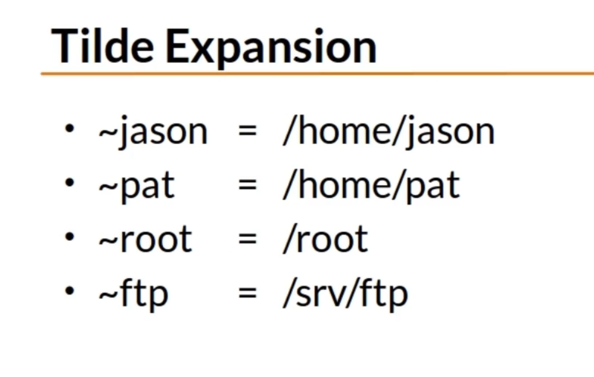

# linux-administration

## Linux directory structure

The most common directories known are,

* /     - "root" the top of the linux system hierarchy
* bin   - binaries and other executable programs
* /etc  - system configuration files
* /home - Home directories
* /opt  - optional or third party software gets intalled here(softwares which are not budled with ubuntu. eg: google earth, vlc etc...)
* /tmp  - temporary space. typically cleared on reboot.good to keep temporaray files
* /usr  - user related programes
* /var  - varuiable files. most notably log files. 

Applications that are not part of the base OS can be installed in,

* /usr/local
* /opt

## The shell

* it is the default interface to shell.
* A program that accepts your commands and execute that commands.
* Also called a command line intrepretter

In the command line $ - indicates that we are using the system as a normal user
                    # - inndicates that we are using the system as a super user. super user is also known as root user or root.

#### Root, the superuser
* Root is all powerful
* Normal accounts can only do a subset of the things root can do.
* Root access is typically restricted to system administrators
* Root access may be reqiired to install, start, or stop an aplication
* Day to day activities will be performed using a normal account

~  - represents home directory

### Basic Linux commands
